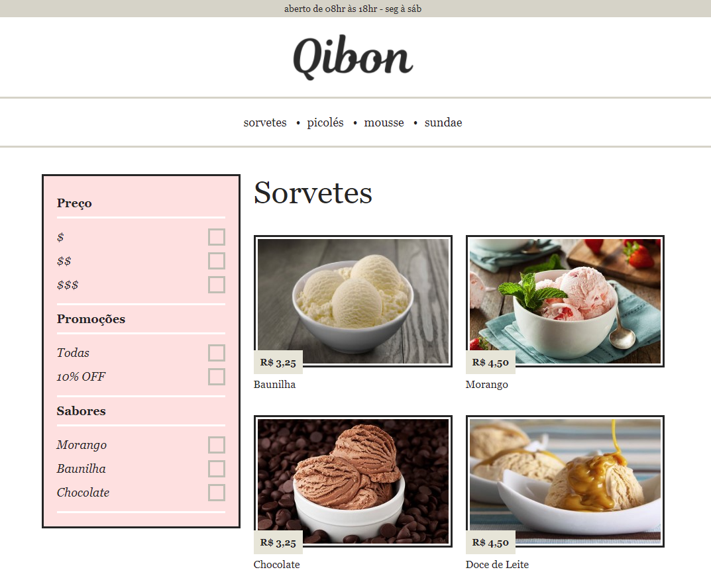

💻 Atualizado em 19 de Maio de 2021 💻

# Projeto Origamid - CSS Avançado Posicionamento (BRAFÉ - 2)

## Objetivo

Curso focado em ensinar na prática como criar um site responsivo do zero, utilizando quatro formas diferentes de CSS.

### Brafé 1

Primeiro layout criado para o mesmo site: https://github.com/gabrielcoelhox/Brafe

## Grade do curso

1. <b>CSS Puro "na mão"</b>  

2. <b>CSS com GRID</b>  

3. <b>CSS com FLEXBOX</b>  

4. <b>CSS com BOOTSTRAP 4</b>  

## Link

https://gabrielcoelhox.github.io/Brafe-2/

## 📷 Veja 📷

## Home

## Demonstração Mobile

